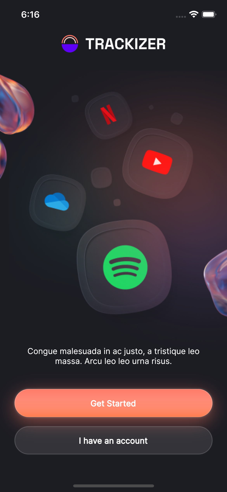

# Trackizer App UI with Flutter

Design Credit: [https://symu.co/freebies/templates-4/trackizer](https://symu.co/freebies/templates-4/trackizer/)

## Screens

### Welcome Screen

### Auth Screens

&nbsp;&nbsp;

&nbsp;&nbsp;

### Other Screens

&nbsp;&nbsp;

&nbsp;&nbsp;

&nbsp;&nbsp;

&nbsp;&nbsp;

&nbsp;&nbsp;

&nbsp;&nbsp;

&nbsp;&nbsp;

&nbsp;&nbsp;